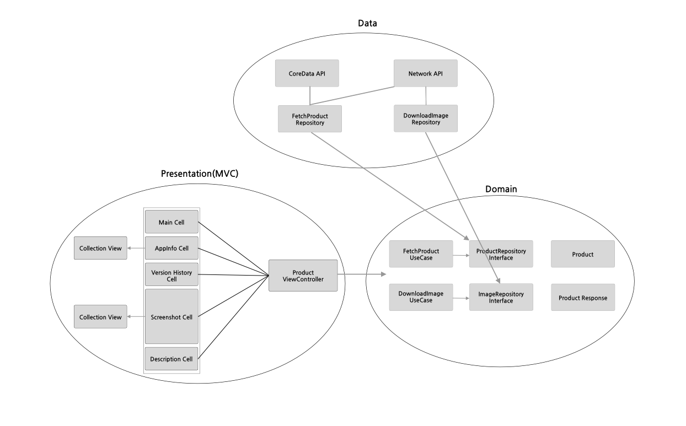

# BefamPage



## Features
페이지에서 주요하다고 생각되는 부분에 대해 구현해보았습니다.

- CollectionView를 통한 App 정보 (앱 평가, 앱 연령 부분)
- Image를 다운로드하여 CollectionView를 통해 Screenshot을 보여주는 기능
- 버전 정보, 앱 설명과 같은 '더보기' 버튼을 눌렀을 때 더 자세한 정보를 보여줄 수 있는 기능
- 스크롤이 제일 위의 앱 이름과 icon이 있는 section을 지날 때 Navigation bar에 앱 아이콘이 생기는 기능

## 사용한 기술
- UIKit
- CoreData

## 추가 설명

### CoreData와 Network
```swift
//DefaultProductRepository.swift
func fetchProduct(cached: @escaping (Product) -> Void,
                  completion: @escaping (Result<Product, Error>) -> Void) {
  persistentStorage.fetchProduct(completion: { result in
    switch result {
    case .success(let responseDTO):
      cached(responseDTO.toDomain().results[0])
    default:
      break
    }
    
    //Fetch from Network
    NetworkService.shared.fetchProduct(completion: { result in
      switch result {
      case .success(let responseDTO):
        self.persistentStorage.save(responseDTO)
        DispatchQueue.main.async {
          completion(.success(responseDTO.toDomain().results[0]))
        }
      case .failure(let error):
        completion(.failure(error))
      }
    })
  })
}
```
서버로부터 Product에 대한 정보를 받아오기전, 이미 CoreData에 어떤 정보가 있다면, 먼저 해당 데이터를 보여주고, Network를 통해 해당 Product 데이터를 받아오고, 이를 다시 CoreData에 저장하는 방식으로 DB를 사용하였습니다.

### Image Download with NSCache
```swift
// DefaultDownloadImageRepository.swift

private let cache = NSCache<NSString, NSData>()

func fetchImage(with url: String, completion: @escaping (Result<Data, Error>) -> Void) {
  let nsString = NSString(string: url)
  
  if let nsData = cache.object(forKey: nsString) {
    let data = Data(referencing: nsData)
    completion(.success(data))
    return
  }
  
  NetworkService.shared.downloadImage(url: url, completion: { data in
    let nsData = NSData(data: data)
    self.cache.setObject(nsData, forKey: nsString)
    DispatchQueue.main.async {
      completion(.success(data))
    }
  })
}
```
이미지 다운로드같은 경우 NSCache를 활용하여 앱이 실행중일 때만 메모리에 저장하여 가져올 수 있도록 구현하였습니다. 
